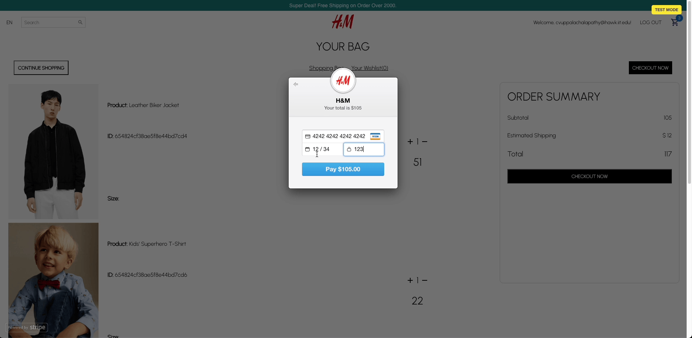

# 🏬 H&M Inspired E-Commerce Store

Welcome to my H&M inspired e-commerce platform—a full-stack solution I've crafted using MongoDB, Express.js, React, and Node.js, delivering a seamless and modern shopping experience.

## 📜 Overview

This project simulates a real-world e-commerce store, providing users with the ability to filter products by category, view detailed product information, add products to their cart, modify quantities, and securely checkout using the Stripe API for payment processing. My back-end ensures all orders are reliably stored in MongoDB.

## 🛠 Tech Stack

### Frontend

- **React**: For building a dynamic and interactive UI.
- **CSS Modules/Sass**: For styling components in a modular and maintainable way.
- **Redux**: For managing application state.

### Backend

- **Node.js/Express.js**: For the server-side logic.
- **MongoDB**: For the database to store products, users, and orders.
- **JWT**: For authentication and authorization.

## 🎞 Application Demo



## 🗂 Folder Structure

```plaintext
/backend
  /models
  /routes
  .env
  index.js
  package-lock.json
  package.json
/front-end
  /node_modules
  /public
  /src
    /components
    /pages
    /redux
    index.js
  package-lock.json
  package.json
```

## 🔐 Authentication & Authorization

We use JWT for secure, token-based authentication and authorization, ensuring user interactions are safely managed.

## 📈 Admin Dashboard (Upcoming Feature)

Development is underway for an admin dashboard to oversee order placements, user management, and product inventory.

## 🎨 UI/UX Highlights

- Interactive & User-Friendly: The interface is designed to be engaging and intuitive.
- Brand Identity: A color palette and design that embody the brand's style and ethos.
- React Confetti: Adds an engaging visual celebration upon successful order placement.

## 🚀 Running the Service Locally

**Prerequisites**

- [Node.js (v14.15.1)](https://nodejs.org/download/release/v14.15.1/)

**Setup**

1. Clone the repository.
2. Navigate to the front-end directory:

```sh
cd front-end
npm install
npm run start
```

In a new terminal, navigate to the back-end directory:

```sh
cd back-end
npm install
node index.js
```

The application should now be up and running locally. 🎊

## 🏁 Conclusion

My README is a testament to my commitment to excellence, providing a detailed guide for developers and users alike. As my platform evolves, I continue to enhance this documentation to reflect the latest updates and features.

## Kudos and Acknowledgements 🌟

This project was a solo endeavor, and a big shout-out goes to... 🥁🥁🥁

- Node and Express, for making the server-side a breeze! 🌬️
- React, for the seamless UI magic! ✨

---

Made with ❤️ by Kishore
